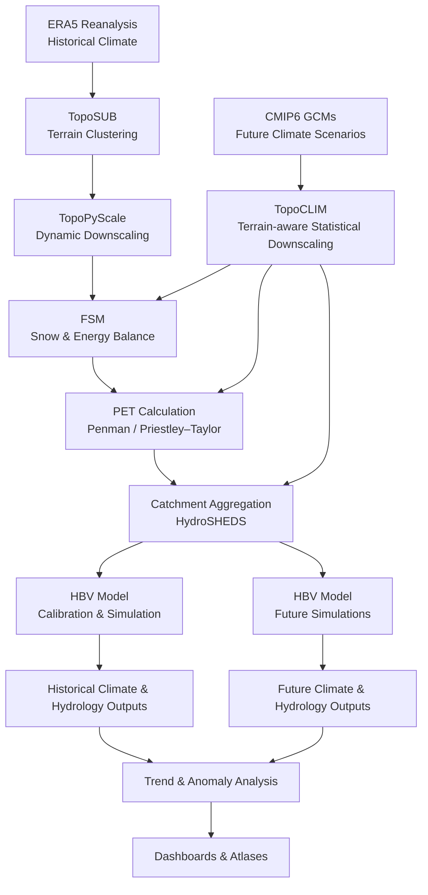

# BWRP Combined Dashboard

This is a unified dashboard combining all three BWRP Shiny applications into a single interface with navigation tabs.

**Live Application**: https://joelfiddes-bwrp.share.connect.posit.cloud/

## Table of Contents

### BWRP Dashboard
- [Overview](#overview)
- [Features](#features)
- [Running Locally](#running-locally)
- [Dependencies](#dependencies)
- [Data Structure](#data-structure)
- [Deployment](#deployment)
- [Navigation](#navigation)
- [License](#license)

### Hydrological Modelling Workflow
- [1. Climate Data Inputs](#1-climate-data-inputs)
- [2. Terrain Representation (TopoSUB)](#2-terrain-representation-toposub)
- [3. Climate Downscaling](#3-climate-downscaling)
- [4. Snow and Surface Energy Modelling (FSM)](#4-snow-and-surface-energy-modelling-fsm)
- [5. Potential Evapotranspiration (PET)](#5-potential-evapotranspiration-pet)
- [6. Catchment-Level Aggregation](#6-catchment-level-aggregation)
- [7. Hydrological Modelling (HBV)](#7-hydrological-modelling-hbv)
- [8. Historical and Future Simulations](#8-historical-and-future-simulations)
- [9. Climate and Hydrological Analysis](#9-climate-and-hydrological-analysis)
- [10. Visualisation and Access](#10-visualisation-and-access)
- [11. Key Design Principles](#11-key-design-principles)
- [12 .Model Workflow Diagram](#12-model-workflow-diagram)

---

## Overview

The BWRP Combined Dashboard integrates:

1. **Climate Forcing Explorer** - Mean catchment-level climate variables
2. **Climate Change Atlas** - IPCC climate scenarios (SSP1-2.6, SSP2-4.5, SSP5-8.5) with anomaly analysis
3. **Water Resources Atlas** - Hydrological model outputs with time series analysis

## Features

- **Tabbed Navigation**: Easy switching between different visualization modes
- **Consistent Interface**: Familiar controls from original apps preserved
- **Shared Resources**: Single deployment with all data accessible from one location
- **Interactive Maps**: Leaflet-based visualization across all tabs
- **Time Series Analysis**: Click catchments to view detailed temporal data (Climate Change & Water Resources tabs)

## Running Locally

```bash
cd bwrp_combined
R
# In R console:
shiny::runApp()
```

Or from command line:
```bash
R -e "shiny::runApp('/Users/joel/src/bwrp/bwrp_combined')"
```

## Dependencies

Required R packages:
- `shiny`
- `sf` (spatial features)
- `leaflet` (interactive maps)
- `dplyr`, `tidyr` (data manipulation)
- `readr` (CSV reading)
- `ggplot2` (plotting)
- `viridisLite`, `RColorBrewer` (color palettes)
- `zoo` (time series)
- `fst` (fast data serialization)
- `tibble` (data frames)

## Data Structure

The combined app references data from the three original app directories:
- `../bwrp_app/` - Climate forcing data
- `../bwrp_climatechange/` - Climate change scenarios and time series
- `../bwrp_wrm_app/` - Water resources model outputs

**Note**: Keep the original app directories intact as this app reads data from them.

## Deployment

To deploy to Posit Connect Cloud:

```r
# In app directory:
rsconnect::writeManifest()
# Then deploy via Posit Connect UI
```

## Navigation

### Tab 1: Climate Forcing Explorer
- Select climate forcing variables (temperature, precipitation, radiation, etc.)
- View spatial distribution across catchments
- Static map view with popup information

### Tab 2: Climate Change Atlas
- Choose IPCC scenarios (SSP1-2.6, SSP2-4.5, SSP5-8.5)
- Toggle between absolute values and anomalies
- Select time periods and seasonal aggregations
- Click catchments to view time series with trend analysis
- Customize visualization with transparency and basemap options
- Download time series data

### Tab 3: Water Resources Atlas
- Select year and hydrological variable
- Toggle between anomaly and annual mean views
- Click catchments to view daily time series
- Analyze water balance components and discharge

## License

GNU General Public License v3.0


# Hydrological Modelling Workflow – Balochistan Water Resources Programme

This repository implements an end-to-end hydrological modelling system designed to assess historical and future water availability in the arid and data-scarce catchments of Balochistan. The workflow integrates terrain-aware climate downscaling, snow and evapotranspiration modelling, and lumped hydrological simulation to produce catchment-scale runoff and water balance outputs.

The system supports **both historical analysis and CMIP6-based future climate scenarios**, using a consistent and reproducible modelling chain.

---

## 1. Climate Data Inputs

### Historical Climate (Baseline)
- **ERA5 reanalysis** provides historical meteorological forcing:
  - Precipitation
  - Air temperature
  - Radiation
  - Wind and humidity

ERA5 is used as:
- The historical reference climate
- The basis for bias adjustment and statistical relationships applied to future climate projections

### Future Climate Projections
- **CMIP6 global climate model outputs**
- Multiple models and scenarios (e.g. SSP pathways)
- Variables include precipitation and temperature

---

## 2. Terrain Representation (TopoSUB)

To efficiently represent Balochistan’s complex terrain, the landscape is simplified using **TopoSUB** topographic clustering.

- Clusters are based on:
  - Elevation
  - Slope
  - Aspect
  - Sky-view factor
- Each cluster represents areas with similar terrain-driven climate behaviour

The same clusters are used consistently for historical and future simulations.

---

## 3. Climate Downscaling

### 3.1 Historical Downscaling (TopoPyScale)

Historical ERA5 data are dynamically downscaled to high spatial resolution (~90 m) using **TopoPyScale**.

This step accounts for:
- Elevation gradients
- Terrain exposure and shading
- Orographic effects

**Output:**  
Terrain-corrected historical climate forcing fields used for hydrological modelling and as a reference for future projections.

---

### 3.2 Future Climate Downscaling (TopoCLIM)

Future CMIP6 projections are downscaled using **TopoCLIM**, a terrain-aware statistical downscaling framework.

TopoCLIM:
- Learns statistical relationships from:
  - ERA5 baseline climate
  - TopoPyScale downscaled reference data
  - TopoSUB terrain clusters
- Applies bias adjustment relative to the historical baseline
- Preserves local topographic controls on climate

**Output:**  
High-resolution, downscaled CMIP6 climate time series consistent with the historical forcing.

---

## 4. Snow and Surface Energy Modelling (FSM)

Where relevant (higher elevations), the **Flexible Snow Model (FSM)** is applied using downscaled climate forcing to simulate:

- Snow accumulation and melt
- Snow water equivalent (SWE)
- Snow height
- Surface energy fluxes

FSM ensures physically consistent treatment of seasonal snow processes.

---

## 5. Potential Evapotranspiration (PET)

Potential evapotranspiration (PET) is computed using physically based methods:

- Penman
- Priestley–Taylor

PET represents atmospheric water demand, a dominant control on hydrology in arid environments.

---

## 6. Catchment-Level Aggregation

High-resolution climate, snow, and PET outputs are aggregated to the **catchment scale**:

- Catchments defined using **HydroSHEDS basin boundaries**
- Topographic clusters are area-weighted within each catchment

**Result:**  
A single, representative forcing time series per catchment.

---

## 7. Hydrological Modelling (HBV)

Each catchment is simulated using a **lumped HBV hydrological model**, adapted for dry and arid regions.

The model represents:
- Soil moisture storage and evapotranspiration losses
- Event-driven runoff and flash flooding
- Limited groundwater recharge and zero-flow periods

The HBV model is calibrated under historical conditions and then applied unchanged to future climate scenarios.

---

## 8. Historical and Future Simulations

The same modelling chain is applied to:

- **Historical baseline climate**
- **Future CMIP6 climate scenarios**

This ensures full methodological consistency when comparing past, present, and future hydrological conditions.

---

## 9. Climate and Hydrological Analysis

For each catchment and scenario, the system computes:

- Precipitation, temperature, PET, and runoff statistics
- Water balance indicators (P − ET)
- Annual and seasonal anomalies
- Long-term trends and variability

---

## 10. Visualisation and Access

Model outputs are delivered through:

- Interactive dashboards (R Shiny)
- Climate Explorer and Water Resources Atlas
- Google Earth Engine spatial analyses

These tools enable exploration of basin-scale climate and hydrological change under future scenarios.


---

## 11. Key Design Principles

- Terrain-aware climate downscaling
- Consistent methods across historical and future scenarios
- Parsimonious hydrological modelling suited to arid regions
- Reproducible and scalable workflow
- Designed for data-scarce environments

---


## 12. Model Workflow Diagram



### Notes
- The **same terrain representation and hydrological model** are used for historical and future simulations.
- This ensures **methodological consistency** when comparing baseline and CMIP6 scenarios.
- FSM and PET are applied identically to both historical and future climate forcings.


